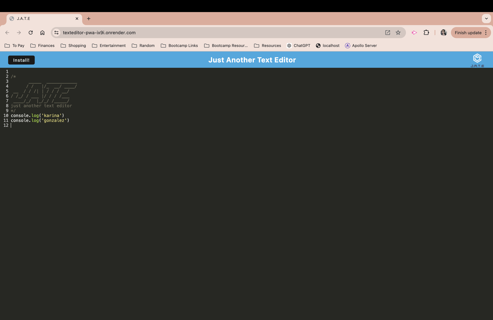
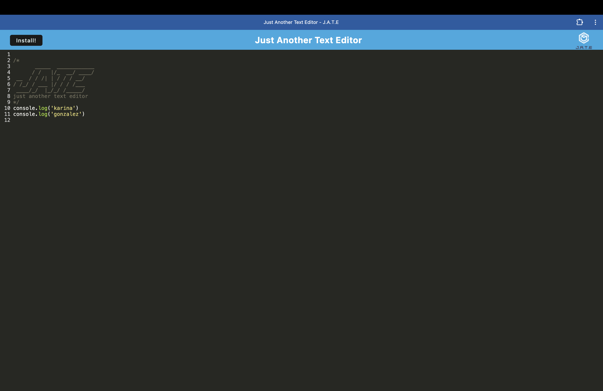

# TextEditor-PWA

## Description

This text editor is a single page progressive web application. It features data persistence which allows users to use offline. When user goes online, notes made offline will show on website application. This application can be downloaded to users desktop, making it available to use offline.

This project has taught me about PWA's, how to create, and work with already exising starter code. 

Provide a short description explaining the what, why, and how of your project. Use the following questions as a guide:

## Installation

- WebpackPwaManifest

## Usage

https://texteditor-pwa-ix9i.onrender.com/

